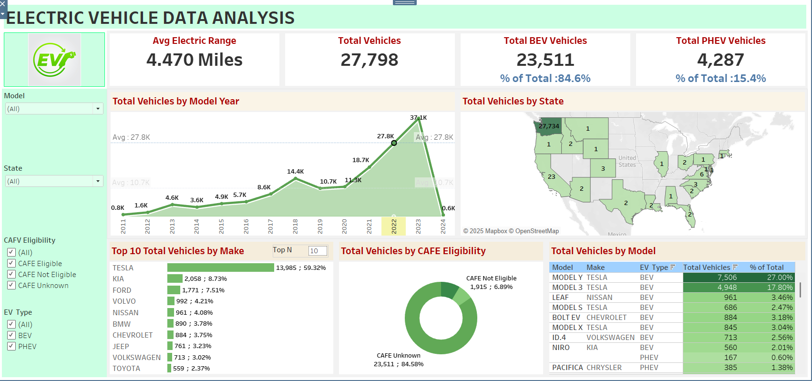

## 🚗 **Electric Vehicle Data Analysis**  
Analyzing EV adoption trends, market distribution, and manufacturer dominance to uncover insights that guide strategy and policy decisions using Tableau-based KPIs and visualizations.  

## 📌 Table of Contents  
- Overview  
- Business Problem  
- Dataset  
- Tools & Technologies  
- Project Structure  
- Data Cleaning & Preparation  
- Exploratory Data Analysis (EDA)  
- Research Questions & Key Findings  
- Dashboard  
- How to Run This Project  
- Final Recommendations  
- Author & Contact  

## 🔎 Overview  
This project explores the U.S. electric vehicle (EV) landscape with a focus on **Battery Electric Vehicles (BEVs)** and **Plug-in Hybrid Electric Vehicles (PHEVs)**. It provides insights into adoption trends, consumer preferences, technological progress, and policy impacts. Tableau dashboards were developed to highlight KPIs, visualize adoption patterns, and identify strategic opportunities.  

## ❗ Business Problem  
As EV adoption accelerates, understanding **growth dynamics, market leaders, and geographic distribution** is critical. This project addresses:  
- How has EV adoption evolved over time?  
- What share do BEVs vs PHEVs hold in the market?  
- Which states, manufacturers, and models dominate EV adoption?  
- What role does **CAFV eligibility** (Clean Alternative Fuel Vehicle incentives) play?  

## 📊 Dataset  
- **Source:** Electric Vehicle Registration Dataset  
- **File Format:** CSV/Text processed into Tableau  
- **Key Variables:**  
  - Model Year  
  - Make & Model  
  - State  
  - EV Type (BEV / PHEV)  
  - Electric Range  
  - CAFV Eligibility  

## 🛠 Tools & Technologies  
- **Tableau** – KPIs, dashboards, interactive visualizations  
- **Excel/CSV** – Data preparation  
- **PDF Reports** – Requirements & executive summary  

## 📂 Project Structure  
electric_vehicle_analysis_tableau/

├── electric_vehicle_requirements.pdf # Business requirements

├── electric_vehicle_executive_summary.pdf # Executive Summary

├── electric_vehicle_data_analysis.twb # Tableau Workbook

├── electric_vehicle_dashboard.png # Final Dashboard Screenshot

└── README.md # Project Documentation

## 🧹 Data Cleaning & Preparation  
- Removed duplicates and incomplete vehicle records.  
- Standardized manufacturer names and EV types (BEV/PHEV).  
- Filtered dataset from **2011 onwards** for trend analysis.  
- Categorized CAFV eligibility (Eligible, Not Eligible, Unknown).  

## 🔬 Exploratory Data Analysis (EDA)  
1. **Growth Trend** – EV adoption accelerated after 2018, peaking in 2023.  
2. **Electric Range** – Avg. EV range = **4.47 miles** (dataset value).  
3. **Vehicle Mix** – BEVs dominate (84.6%), PHEVs hold 15.4%.  
4. **Market Leaders** – Tesla leads with **59.3% share**; Kia, Ford, Volvo follow.  
5. **Popular Models** – Tesla Model Y (27%), Model 3 (17.8%), Nissan Leaf, Chevrolet Bolt EV.  
6. **Geographic Spread** – Washington State leads adoption with **27K+ EVs**.  
7. **CAFV Eligibility** – Majority “Unknown” (84.6%), only 6.9% not eligible.  

## ❓ Research Questions & Key Findings  
- Which EV type dominates? → **BEVs (84.6%)**.  
- Which manufacturer leads? → **Tesla (59.3%)**.  
- What are the most popular models? → **Tesla Model Y & Model 3**.  
- Which state has the highest adoption? → **Washington (27,734 EVs)**.  
- Do incentives influence adoption? → Data limited (CAFV Unknown = 84.6%), suggesting need for clearer incentive tracking.  

## 📊 Dashboard  
The interactive Tableau dashboard includes:  
- **KPIs**: Avg Electric Range, Total Vehicles, BEV & PHEV Split  
- **Line Chart**: Vehicles by Model Year (growth trend)  
- **Map Chart**: Vehicles by State (geographic distribution)  
- **Bar Chart**: Top 10 Manufacturers  
- **Donut Chart**: CAFV Eligibility Distribution  
- **Tree Map**: Top Models  

## 📌 Dashboard Preview:  
  

## ▶ How to Run This Project    
1. Open `electric_vehicle_analysis.twbx` in **Tableau Desktop / Tableau Public**.  
2. Since this is a **packaged workbook (.twbx)**, the dataset is already included — no external connection required.  
3. Navigate through the dashboards and worksheets to explore KPIs, trends, and insights.  
4. Use interactive filters (Model, State, EV Type, CAFV) to drill down into specific views.  
  

## ✅ Final Recommendations  
- **Support BEV Growth** – Expand charging infrastructure to match BEV dominance.  
- **Incentivize PHEVs** – Strengthen hybrid programs to balance market adoption.  
- **Policy Clarity** – Improve CAFV data capture to measure impact of incentives.  
- **Market Expansion** – Focus on high-adoption states while targeting low-adoption states for growth.  
- **Model Strategy** – Learn from Tesla’s success (Model Y, Model 3) for pricing and range strategies.  

---

## 👤 Author & Contact  
**Soundarya G S**  
Business/Data Analyst  
📧 Email: [soundaryags948@gmail.com]  
🔗 LinkedIn: [https://www.linkedin.com/in/soundarya-g-s/]  
